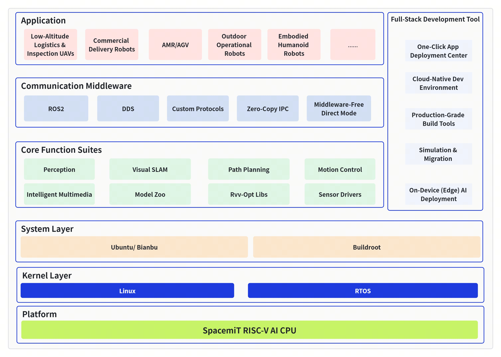

[English](./README.md) | [简体中文](./README_cn.md)

SpacemiT Robotics
==================

**Committed to an integrated RISC-V + Robotics intelligence stack**

SpacemiT Robotics is the open-source robotics community under SpacemiT. By deeply integrating **RISC-V architecture chips**, **AI foundation models**, and **robot bodies**, we fully tap into RISC-V’s flexibility and potential in low-power operation, AI compute, and real-time control. Our goal is to provide an open, efficient, and scalable next-generation robotic infrastructure platform, bringing general intelligence into the physical world.

## 1. Repository Layout

The top-level structure of this repository (`spacemit_robotis`) is organized as follows to help you quickly locate code and build entry points:

```text
spacemit_robotis/
├── application/    # Applications and example projects (robot apps, demos, etc.)
├── build/          # Unified build system: envsetup.sh, build.sh, CMake/ROS2 build scripts
├── components/     # Core components: model zoo (LLM/VLM), peripheral drivers, system libs, multimedia, etc.
├── middleware/     # Middleware: ROS2 packages (perception, planning, control, SLAM, etc.)
├── scripts/        # Scripts and CI (e.g. GitHub Actions workflows)
├── target/         # Build target configurations (JSON files selected by lunch, e.g. kx-generic-omni_agent)
├── agent/          # AI Agent integration (skill, discovery scripts, preflight checks)
└── tools/          # Development and debugging tools
```

## 2. System Architecture

The overall system architecture is illustrated below:



## 3. Build & Compilation

### 3.1 Fetching the Code

```bash
sudo apt update
sudo apt install repo

mkdir spacemit_robot
cd spacemit_robot

repo init -u https://github.com/spacemit-robotics/manifest.git -b main -m default.xml
repo sync -j4
repo start robot-dev --all
```

After synchronization completes, enter the repository root (for example, `spacemit_robotis`) to build.

### 3.2 One-Command Build

In the repository root, load the environment, select a build target, and run a full build to generate sample applications for each component:

```bash
source build/envsetup.sh
lunch                    # Interactively select a target such as 3, or directly: lunch kx-generic-omni_agent
m                        # One-command build to generate applications
```

For more usage details (single-package build with `mm`, cleaning, `build.sh`, etc.), please refer to [`build/README.md`](https://github.com/spacemit-robotics/build/blob/main/README.md) and [`target/README.md`](https://github.com/spacemit-robotics/target/blob/main/README.md).

### 3.3 Running Examples

Build artifacts are installed under the `output/staging` directory. After you run `source build/envsetup.sh`, the paths to the generated binaries are automatically added to your environment, so you can execute the following example commands from any working directory.

```bash
# Object detection
yolov8 components/model_zoo/cv/examples/yolov8/config/yolov8.yaml
```

For ROS2-based applications:

```bash
sros2_setup                 # Load ROS2 + SDK overlay
ros2 run <package> <node>   # Example: ros2 run peripherals_lidar_node lidar_2d_node
```

For the detailed run instructions of each package and application (parameters, launch files, etc.), please refer to the corresponding `README` in each directory.

### 3.4 AI Agent Integration

The SDK includes a built-in AI Agent integration framework, enabling AI assistants (such as [OpenClaw](https://github.com/openclaw/openclaw)) to automatically discover modules, check prerequisites, build, and run examples.

```bash
# Register the AI skill (run once after repo sync)
bash agent/install.sh
```

Once registered, the AI can automatically:
- Discover all module capabilities and build status
- Check prerequisites (binaries, model files, hardware connections)
- Build, download models, and run examples on demand

## 4. Vision & How to Join

We believe RISC-V is the future of the robotics industry. Whether you are an algorithm engineer, embedded developer, or robotics enthusiast, you are welcome to participate in the following ways:

1. **Submit Issues/PRs**: Help us optimize models and software stacks on RISC-V chips.
2. **Star & Follow**: Star our core repositories to stay up to date with the latest SDK releases.
3. **Contact Us**: Visit [`https://www.spacemit.com/`](https://www.spacemit.com/)

