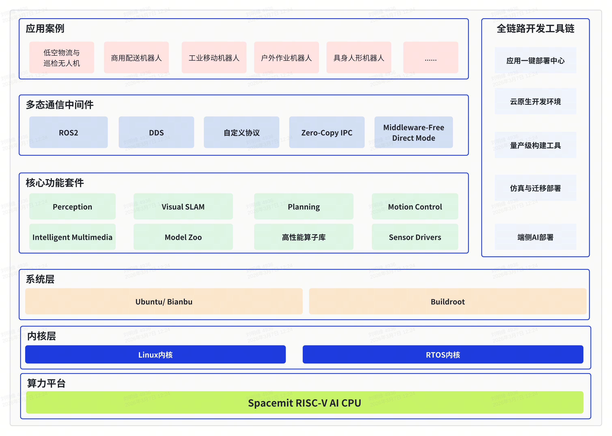

# SpacemiT Robotics

**致力于 RISC-V + 机器人智能化一体技术栈**

SpacemiT Robotics 是进迭时空（SpacemiT）旗下的机器人开源社区。我们通过深度整合 **RISC-V 架构芯片**、**Ai大模型** 与 **机器人本体**，充分挖掘 RISC-V 在低功耗、AI 算力与实时控制中的高灵活性潜力。提供一个开放、高效、可扩展的新一代机器人基础设施平台，让通用智能真正融入物理世界。

## 系统架构



本仓库（spacemit_robotis）顶层目录如下，便于快速定位代码与构建入口：

```
spacemit_robotis/
├── application/    # 应用与示例工程（机器人应用、Demo 等）
├── build/          # 统一构建系统：envsetup.sh、build.sh、CMake/ROS2 构建脚本
├── components/     # 核心组件：模型库(LLM/VLM)、外设驱动、系统库、多媒体等
├── middleware/     # 中间件：ROS2 功能包（感知、规划、控制、SLAM 等）
├── scripts/        # 脚本与 CI（如 GitHub Actions 工作流）
├── target/         # 构建目标配置（lunch 选择的 *.json，如 kx-generic-omni_agent）
└── tools/          # 开发与调试工具
```

## 构建编译

### 代码获取


```bash

sudo apt update
sudo apt install repo

mkdir spacemit_robot
cd spacemit_robot

repo init -u https://github.com/spacemit-robotics/manifest.git -b main -m default.xml
repo sync -j4
repo start robot-dev --all
```

同步完成后，进入仓库根目录（如 spacemit_robotis）进行构建。

### 一键编译

在仓库根目录加载环境、选择构建目标后执行全量编译可直接生成各组件的示例应用：

```bash
source build/envsetup.sh
lunch                    # 交互选择目标如3，或直接：lunch kx-generic-omni_agent
m                        # 一键编译生成应用
```

更多用法（单包构建 mm、清理、build.sh 等）见 [build/README.md](https://github.com/spacemit-robotics/build/blob/main/README.md) 与 [target/README.md](https://github.com/spacemit-robotics/target/blob/main/README.md)。

### 示例运行

构建产物安装在 output/staging。

```bash
# 目标检测
yolov8 components/model_zoo/cv/examples/yolov8/config/yolov8.yaml
```

如果是ros2的应用

```bash
sros2_setup              # 加载 ROS2 + SDK  overlay
ros2 run <package> <node>   # 例如：ros2 run peripherals_lidar_node lidar_2d_node
```

各功能包与应用的运行方式（参数、launch 等）见对应目录下的 README。

## 愿景与加入我们

我们相信 RISC-V 是机器人产业的未来。无论你是算法工程师、嵌入式开发者还是机器人爱好者，欢迎通过以下方式参与：

1.  **提交 Issue/PR**: 帮助我们优化模型在RISC-V芯片上的表现。
2.  **Star 关注**: 关注我们的核心仓库，获取最新的 SDK 更新。
3.  **联系我们**: [www.spacemit.com](https://www.spacemit.com/)